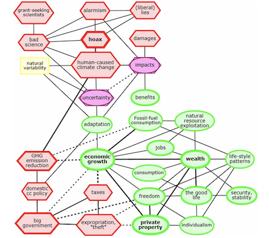

```{r load_packges, eval = TRUE, message = FALSE, echo = FALSE, warning = FALSE}
library(magrittr)
library(polmineR)
library(svglite)
library(DiagrammeR)
library(DiagrammeRsvg)
library(data.table)
library(gradget) # https://github.com/PolMine/gradget
library(igraph, warn.conflicts = FALSE)
library(xts, quietly = TRUE, warn.conflicts = FALSE, verbose = FALSE) # plotting nice time-series
library(DT) # nice datatable output
library(RColorBrewer) # nice colors
```

```{r use_migparl, echo = FALSE, message = FALSE}
use("MigParl")
```


## Objectives {.smaller}

- DFG project "The populist challenge in parliament" (2019-2021, in cooperation with [Christian Stecker](https://www.mzes.uni-mannheim.de/d7/de/profiles/christian-stecker), [Marcel Lewandowsky](https://de.wikipedia.org/wiki/Marcel_Lewandowsky), [Jochen Müller](https://ipk.uni-greifswald.de/politikwissenschaft/professor-dr-jochen-mueller/))

- PolMine Project:
  - long history of experiments with cooccurrence graphs and graph visualisation
  - long history of difficulties to make sense of this analytical approach (derived from corpus linguistics) from the point of view of social science methodology
  - *graph annotation widget* (gradget) as a recent development: New workflow that combines qualitative and quantitative exploration of cooccurrence graphs

- Substantial interest: Data-driven (but conceptually guided) reconstruction of AfD ideology.

- Methodological interest: 
  - Validity and intersubjectivity of data-driven, "distant reading" approaches [@Moretti2013]
  - Special focus: Interactive graph annotation as an approach to generate intersubjectively shared interpretations/understandings of discourse patterns. 
  

# Objectives and Theory {.inverse}

## Mapping ideologies {.smaller}

- anlysing ideolgies as the relational analysis of concepts:<br/>"[...] ideologies are configurations of political concepts - such as liberty, democracy, justice, and nationhood - in which particular interpretations of each constituent concept have been selected out of an indeterminate range of meanings they may signify." [@Freeden1998, p. 748]

- Mudde's definition of populism:<br/>"I define populism as an ideology that considers society to be ultimately separated into two homogeneous and antagonistic groups, ‘the pure people’ versus ‘the corrupt elite’, and which argues that politics should be an expres- sion of the volonté générale (general will) of the people." [@Mudde2004, p. 543]

- referring to Freeden, Mudde sees populism as "thin-centered ideology" [@Mudde2004, p. 544]

- cognitive-affective mapping as a recent approaches to analyse the relational nature of ideologies [@HomerDixon2013; @HomerDixon2014]


## Mapping the ideology of AfD {.smaller}

- "end of ideology" [@Bell1960], "catch-all party" [@Kirchheimer1965], but persistent tradition to align parties with ideologies (such as conservatism, socialism, green political thought, liberalism)

- perils of ascribing (thin) populist ideology to AfD:
  - AfD not to be classified as populist _a priori_
  - this is a matter of empirical research!

- change within and beyond populism
  - possibility that AfD may enter a post-populist stage, and turns into a conservative, or nationalist party (parliamentarian transformation of AfD)
  - even if AfD is populist, alignments of populism with other ideologies, varieties of populism

- requirement to have a research instrument to empirically reconstruct the ideology of AfD, including the potential internal variation if ideology

- Q: Persistence of populist traits of AfD in parliament, (variation of) ideological alignments of AfD.


# Data {.inverse}

## The MigParl Corpus {.smaller}

- corpora of parliamentary debates as hallmark of the PolMine Project: GermaParl

- The following analysis is based on the MigTex corpus:
  - The corpus has been prepared in the MigTex Project ("Textressourcen für die Migrations- und Integrationsforschung", funding: BMFSFJ)
  - Preparation of all plenary debates in Germany's regional parliaments (2000-2018) using the "Framework for Parsing Plenary Protocols" (*frappp*-package)
  - Extraction of a thematic subcorpus using unsupervised learning (topic modelling)

- Size of the MigParl corpus:<br/>`r size("MIGPARL")` tokens

- size without interjections and presidency:<br/>`r size("MIGPARL") - size(partition("MIGPARL", interjection = TRUE)) - size(partition("MIGPARL", role = "presidency"))`

- MigParl corpus used as "proof of concept" - FedParl corpus (all debates in regional parliaments) to be used for the "real" / "full" analysis


## MigParl by year {.flexbox .vcenter}

```{r token_by_year, echo = FALSE, message = FALSE, cache = TRUE}
size_year <- size("MIGPARL", "year")
barplot(
  height = size_year[["size"]] / 100000,
  names.arg = size_year[["year"]],
  ylab = "#tokens (100 000)",
  xlab = "year",
  las = 2
)
```


## AfD in MigParl - tokens {.flexbox .vcenter}

```{r token_afd, echo = FALSE, message = FALSE, cache = TRUE}
afd <- corpus("MIGPARL") %>% subset(party == "AfD") %>% subset(interjection == FALSE)
afd_year <- size(afd, "year")
barplot(
  height = afd_year[["size"]] / 100000,
  names.arg = afd_year[["year"]],
  ylab = "#tokens (100 000)",
  xlab = "Year",
  las = 2
)
```


## AfD in MigParl - share {.flexbox .vcenter}

```{r share_afd, echo = FALSE, message = FALSE, cache = TRUE}
all_year <- size("MIGPARL", s_attribute = "year")[, "what" := "all"]
afd <- subset("MIGPARL", party == "AfD" & interjection == FALSE)
afd_year <- size(afd, "year")[, "what" := "AfD"]
dt <- rbindlist(list(all_year, afd_year))
dt_share <- dcast(data = dt, year ~ what, value.var = "size")
dt_share[, "year" := as.integer(year)]
dt_share[, "AfD" := ifelse(is.na(AfD), 0, AfD)]
dt_share[, "afd_share" := round((AfD / all) * 100, 2)]
dt_share_min <- dt_share[year > 2010]
barplot(
  height = dt_share_min[["afd_share"]],
  names.arg = dt_share_min[["year"]],
  ylab = "AfD share (percent)",
  xlab = "Year",
  las = 2,
  col = "steelblue"
)
```


## MigParl - regional dispersion {.flexbox .vcenter}

```{r afd_geography, message = FALSE, echo = FALSE, cache = TRUE}
dt <- corpus("MIGPARL") %>%
  subset(party == "AfD") %>%#
  subset(interjection == FALSE) %>%
  size(afd, s_attribute = "regional_state")
setorderv(dt, cols = "size", order = -1L)
barplot(
  height = dt$size,
  names.arg = dt$regional_state,
  las = 2,
  col = "steelblue",
  ylab = "Number of tokens",
  xlab = "Regional parliament"
)
```


## So what's in the data?

* (unsurprising) peak of debates on migration and integration affairs in 2015.

* total number of words spoken by AfD parliamentarians and the relative share has increased, as the AfD made it into an increasing number of regional parliaments.

* AfD presence is stronger in the Eastern regional states, corresponding to stronger electoral results there. 


# Method {.inverse}

## The PolMine Project R Packages

- The PolMine Project is essentially about using corpora in social science research:
  - *polmineR*: basic vocabulary for corpus analysis
  - *RcppCWB*: wrapper for the Corpus Workbench (using C++/Rcpp, follow-up on rcqp-package)
  - *cwbtools*: tools to create and manage CWB indexed corpora

- objectives of the polmineR package:
  - working efficiently with large, structurally and linguistically annotated corpora
  - offer a basic vocabulary for corpus analysis
  - serve as a toolset to integrate qualitative and quantitative approaches to data in a seamless workflow


## Quantity & quality | Opening the blackbox of dictionary-based corpus analysis {.smaller}

```{r get_senti_ws, eval = TRUE, message = FALSE, echo = FALSE}
sentiws_file <- path.expand("~/Lab/gitlab/afd_ideology/data/sentiws.rds")
if (!file.exists(sentiws_file)){
  gist_url <- "https://gist.githubusercontent.com/PolMine/70eeb095328070c18bd00ee087272adf/raw/c2eee2f48b11e6d893c19089b444f25b452d2adb/sentiws.R"
  devtools::source_url(gist_url) # danach ist Funktion verfügbar
  sentiws <- get_sentiws()
  saveRDS(object = sentiws, file = sentiws_file)
} else {
  sentiws <- readRDS(sentiws_file)
}

good <- sentiws[weight > 0][["word"]]
bad <- sentiws[weight < 0][["word"]]

options("polmineR.pagelength" = 4L)
options("polmineR.left" = 10L)
options("polmineR.right" = 10L)
```

```{r activate_germaparl, eval = TRUE, echo = FALSE, message = FALSE, cache = FALSE}
use("GermaParl")
```

```{r show_sentiment_vovab, render = knit_print, eval = TRUE, message = FALSE, echo = TRUE, cache = FALSE}
kwic("GERMAPARL", query = "Islam", positivelist = c(good, bad)) %>%
  highlight(lightgreen = good, orange = bad) %>%
  tooltips(setNames(sentiws[["word"]], sentiws[["weight"]])) %>%
  knit_print()
```


## Outline of the workflow

* data-driven identification of all significant cooccurrences 

* term extraction / calculating keywords as illustration / first analytical take on the data: conveys logic of using difference tests to bring out noteworthy features from a unit of analysis (subcorpus/word context)

* To gain a first insight into the thematic foci and linguistic features of AfD speakers, we use the technique of term extraction [@Baker2006]: get terms that occur more often in a corpus of interest (coi) compared to a reference corpus (ref) than would be expected by chance. The statistical test used is a chi-squared test [@Rose98measuresfor].

* equivalent logic of diffence test to get cooccurrences (log likelihood statistic) - but need to filter and to work with key cooccurrences (statistical significant cooccurrences)


## Statistically significant words

* The point of departure is a contingency table

|              |   coi     |      ref |   TOTAL  |
| ------------ | :-------: | :------: | :------: |
| count token  | $o_{11}$  | $o_{12}$ | $r_{1}$  |
| other tokens | $o_{21}$  | $o_{22}$ | $r_{2}$  |
| TOTAL        | $c_{1}$   | $c_{2}$  |   N      |

<br/>

* The chi-squared statistic is calculated as follows (for a single word)


$$ X^{2} = \sum{\frac{(O_{ij} - E_{ij})^2}{O_{ij}}}$$


## Term extraction I {.smaller}

```{r features_word_pos, eval = TRUE, message = FALSE, echo = FALSE, warning = FALSE, cache = FALSE}
afd_count <- corpus("MIGPARL") %>%
  subset(party == "AfD" & interjection == FALSE) %>%
  count(p_attribute = c("word", "pos"))
all_count <- corpus("MIGPARL") %>%
  subset(interjection = FALSE) %>%
  count(p_attribute = c("word", "pos"))
a <- features(x = afd_count, y = all_count, included = TRUE) %>%
  subset(count_coi >= 5) %>%
  subset(chisquare >= 11.83)
DT::datatable(format(a))
```


## Term extraction II (ADJA - NN){.smaller}

```{r ngrams_ART_NN, eval = TRUE, message = FALSE, echo = FALSE, warning = FALSE, cache = FALSE}
afd_ngrams <- corpus("MIGPARL") %>%
  subset(party == "AfD") %>%
  subset(interjection == FALSE) %>%
  ngrams(n = 2, c("word", "pos"))
all_ngrams <- corpus("MIGPARL") %>%
  subset(interjection = FALSE) %>%
  ngrams(n = 2, p_attribute = c("word", "pos"))

a <- features(x = afd_ngrams, y = all_ngrams, included = TRUE) %>%
  subset(count_coi >= 5) %>%
  subset(chisquare >= 11.83)

b <- subset(a, a@stat[["1_pos"]] == "ADJA")
b <- subset(b, b@stat[["2_pos"]] == "NN")
b <- subset(b, !b@stat[["2_word"]] %in% c("Kollegen", "Damen", "Präsidium", "Herr", "Besucher", "Abgeordnete", "Frau", "Gäste", "Zuschauer"))
b <- subset(b, !b@stat[["1_word"]] == "``")
b <- subset(b, !b@stat[["2_word"]] == "``")
dt <- b@stat[, "1_pos" := NULL][, "2_pos" := NULL][, "exp_coi" := NULL][, "rank_chisquare" := NULL]
dt[, "chisquare" := round(chisquare, 2)]
DT::datatable(dt)
```


## Term extraction III (NN-ART-NN) {.smaller}

```{r ngrams_nn_art_nn, eval = TRUE, message = FALSE, echo = FALSE, warning = FALSE, cache = FALSE}
afd_ngrams <- corpus("MIGPARL") %>% 
  subset(party == "AfD") %>%
  subset(interjection == FALSE) %>%
  ngrams(n = 3L, c("word", "pos"))
all_ngrams <- corpus("MIGPARL") %>%
  subset(interjection == FALSE) %>%
  ngrams(n = 3, p_attribute = c("word", "pos"))

a <- features(x = afd_ngrams, y = all_ngrams, included = TRUE) %>%
  subset(count_coi >= 5) %>%
  subset(chisquare >= 11.83)

b <- subset(a, a@stat[["1_pos"]] == "NN")
b <- subset(b, b@stat[["2_pos"]] == "ART")
b <- subset(b, b@stat[["3_pos"]] == "NN")
b <- subset(b, !b@stat[["1_word"]] == "%")

b@stat[, "1_pos" := NULL][, "2_pos" := NULL][, "3_pos" := NULL][, "rank_chisquare" := NULL]
b@stat[, "chisquare" := round(chisquare, 2)]
b@stat[, "exp_coi" := round(exp_coi, 2)]
DT::datatable(b@stat)
```


## Intermediate findings

* assumed features of populism remain present when AfD arrived in parliament:
  - vocabulary that indicates the critique of established parties and elites.
  - foreigners and asylum-seekers are an object of concern (using pejorative language)

* will results be different once we use the full FedParl corpus?


## cooccurrences and  cooccurrence graphs

* the statistical/mathematical logic of calculating cooccurrences is identical with the one explained for term extraction, but the log likelihood test is used:

$$ G^{2} = 2 \sum{O_{ij} log(\frac{O_{ij}}{E_{ij}})} $$

* calculation of all statistically significant cooccurrences in a corpus (effects of corpus size!) - available in polmineR starting with v0.7.9.11

* Cooccurrence graphs are a popular eye-catcher [@Rhizome2013; @2016TMid].

* The visualisations are very suggestive and seem to be a great condensation of ideas we have about discourse. But are these interpretations sound and do they meet standards of intersubjectivity? 


## Filtering and annotating cooccurrences

* objective: get the significant cooccurrences of the AfD in parliamentary discourse: We are not just interested in all statistically significant cooccurrences, but more specifically in those that distinguish AfD speech-making from speeches made by parliamentarians of other factions. 

* second difference test (chi-squared statistic) with cooccurrences in speeches by all other parliamentarians. See the [code for these slides](https://github.com/PolMine/gcdh_slides) to learn how this is implemented in polmineR.

* Cp. [CorporaCoCo R package](https://CRAN.R-project.org/package=CorporaCoCo) [@CorporaCoCo2017], see also [this research note on co-occurrence comparison techniques](https://www.birmingham.ac.uk/Documents/college-artslaw/corpus/conference-archives/2017/general/paper362.pdf).

* Towards intersubjectivity: three-dimensional, interactive graph visualisations that can be annotated (called gradgets, for graph annotation widgets). 


# Mapping AfD {.inverse}

## AfD Cooccurrences (unfiltered) {.smaller}

```{r migparl_noise, message = FALSE, echo = FALSE, eval = TRUE, cache = TRUE, warning = FALSE}
big_stopwords <- paste(
  toupper(substr(tm::stopwords("de"), 1,1)),
  substr(tm::stopwords("de"), 2, length(tm::stopwords("de"))),
  sep = ""
)

migparl_noise <- terms("MIGPARL", p_attribute = "word") %>%
  noise() %>%
  unlist() %>%
  c(big_stopwords, "dass") %>%
  unique()
```


```{r afd_cooccurrences, message = FALSE, echo = FALSE, eval = TRUE, warning = FALSE}
afd_rds_file <- path.expand("~/Lab/github/gcdh_slides/data/afd_cooc.rds")
if (!file.exists(afd_rds_file)){
  afd_cooc <- partition("MIGPARL", party = "AfD", interjection = FALSE) %>%
    Cooccurrences(
      left = 10L, right = 10L,
      p_attribute = "word", stoplist = migparl_noise, verbose = TRUE, progress = TRUE
      ) %>%
    ll() %>%
    decode()
  afd_cooc <- subset(afd_cooc, ab_count >= 5) %>% subset(ll >= 10.83)
  saveRDS(object = afd_cooc, file = afd_rds_file)
} else {
  afd_cooc <- readRDS(afd_rds_file)
}
```


```{r ref_cooccurrences, echo = FALSE, message = FALSE, warning = FALSE}
rds_file <- path.expand("~/Lab/github/gcdh_slides/data/afd_cooc_features.rds")

if (!file.exists(rds_file)){
  all_cooc <- partition("MIGPARL", interjection = FALSE) %>%
    Cooccurrences(left = 10L, right = 10L, p_attribute = "word", stoplist = migparl_noise, verbose = TRUE) %>%
    ll() %>%
    subset(ll >= 10.83) %>%
    subset(ab_count >= 5) %>%
    decode()
  
  afd_features <- features(afd_cooc, all_cooc, included = TRUE)
  afd_features@stat <- afd_features@stat[1L:2500L]
  saveRDS(object = afd_features, file= rds_file)
} else {
  afd_features <- readRDS(file = rds_file)
}
```

```{r cooc_all, echo = FALSE, message = FALSE, warning = FALSE, render = knit_print}  
afd_cooc@p_attribute <- "word"
afd_features@p_attribute <- "word"
afd_features@stat <- afd_features@stat[1:150]
afd_min <- subset(afd_cooc, by = afd_features)
dt <- copy(afd_min@stat)
dt[, "a_id" := NULL][, "b_id" := NULL][, "size_window" := NULL]
dt[, "i.exp_coi" := NULL][, "i.exp_ref" := NULL][, "i.ll" := NULL][, "i.rank_ll" := NULL]
dt[, "rank_ll" := NULL][, "exp_ref" := NULL]
dt[, "ll" := round(ll, 2)]
dt[, "count_coi" := NULL][, "count_ref" := NULL][, "exp_coi" := NULL]
setcolorder(x = dt, neworder = c("a_word", "b_word", "ab_count", "a_count", "b_count", "ll"))
setorderv(dt, cols = "ll", order = -1L)
DT::datatable(dt)
```  


## Graph visualisation (2D, N = 100) {.smaller}

```{r, echo = FALSE, message = FALSE, warning = FALSE}
make_igraph <- function(n, afd_features){
  afd_features@stat <- afd_features@stat[1:n]
  G <- subset(afd_cooc, by = afd_features) %>%
    as_igraph() %>%
    igraph_add_coordinates(layout = "kamada.kawai", dim = 2) %>%
    igraph_add_communities() %>% 
    rescale(-250, 250)
  
  ll <- unlist(sapply(E(G)$ll, function(x) x[1]))
  G <- igraph::delete_edge_attr(G, name = "ll")
  E(G)$ll <- ll
  G
}
```

```{r, eval = TRUE, echo = FALSE, message = FALSE, warning = FALSE}
afd_features <- readRDS(file = rds_file)
make_igraph(150, afd_features) %>%
  gradget::as.dgr_graph() %>%
  render_graph()
# %>%
#   DiagrammeRsvg::export_svg() %>%
#  svgPanZoom::svgPanZoom(width = "100%", height = "75%")
```


## Graph-Visualisierung (2D, N = 250) {.smaller}

```{r, echo = FALSE, message = FALSE, warning = FALSE}
make_igraph(250, afd_features) %>% gradget::as.dgr_graph() %>% render_graph()
```


## Graph-Visualisierung (2D, N = 400) {.smaller}

```{r, echo = FALSE, message = FALSE, warning = FALSE}
make_igraph(400, afd_features) %>% gradget::as.dgr_graph() %>% render_graph()
```


## Where we stand

- The graph layout depends heavily on filter decisions.

- Filtering is necessary, but there are difficulties to justify filter decisions.

- Graph visualisation implies many possibilities to provide extra information, but there are perils of information overload.

- If we try to omit filter decisions, we run into the problem of overwhelming complexity of large graphs.

- How to handle the complexity and create the foundations for intersubjectivity? 


## Graph visualisation (3D) {.smaller}

```{r, eval = FALSE, echo = FALSE, cache = TRUE}
widget_1_file <- "/Users/andreasblaette/Lab/gitlab/gradget_slides/widget_1.html"
if (!file.exists(widget_1_file)){
  afd <- partition("MIGPARL", party = "AfD", interjection = FALSE)
  afd_features@stat <- afd_features@stat[1:400]
  afd_features_min <- subset(afd_cooc, by = afd_features)
  afd_features_min@stat <- afd_features_min@stat[!is.na(ll)]
  afd_features_min %>%
    as_igraph() %>%
    igraph_add_coordinates(layout = "kamada.kawai", dim = 3) %>%
    igraph_add_communities() %>% 
    rescale(-250, 250) %>%
    igraph_add_kwic(subcorpus = afd) %>%
    igraph_as_gradget_data() -> gr_dat
  
  widget <- gradget(gr_dat, anaglyph = FALSE)
  
  htmlwidgets::saveWidget(widget = widget, file = widget_1_file)
}
```


```{r, eval = FALSE, echo = FALSE, message = FALSE, cache = TRUE}
widget_2_file <- "/Users/andreasblaette/Lab/gitlab/gradget_slides/widget_2.html"
if (!file.exists(widget_2_file)){
  afd <- partition("MIGPARL", party = "AfD", interjection = FALSE)
  
  afd_features@stat <- afd_features@stat[1:400]
  afd_features@stat <- afd_features@stat[!is.na(ll)]
  gr_dat <- subset(afd_cooc, by = afd_features) %>%
    as_igraph() %>%
    igraph_add_coordinates(layout = "kamada.kawai", dim = 3) %>%
    igraph_add_communities() %>% 
    rescale(-250, 250) %>%
    igraph_add_kwic(subcorpus = afd) %>%
    igraph_as_gradget_data()
  
  widget <- gradget(gr_dat, anaglyph = TRUE)
  
  htmlwidgets::saveWidget(widget = widget, file = widget_2_file)
}

# <iframe title="widget2" width="100%"  src="widget_2.html" frameborder="0" scrolling="no" onload="resizeIframe(this)" padding="0em !important" margin-left="0 !important"></iframe>

```


```{r, echo = FALSE, eval = FALSE, message = FALSE, cache = TRUE}
widget_3_file <- "/Users/andreasblaette/Lab/gitlab/gradget_slides/widget_3.html"

if (!file.exists(widget_3_file)){
  afd_cooc <- readRDS("/Users/andreasblaette/Lab/gitlab/gradget_slides/data/afd_cooc.rds")
  afd_features <- readRDS("/Users/andreasblaette/Lab/gitlab/gradget_slides/data/afd_cooc_features.rds")
  
  afd_features@stat <- afd_features@stat[1:400]
  afd_features@stat <- afd_features@stat[!is.na(ll)]
  g <- subset(afd_cooc, by = afd_features) %>%
    as_igraph() %>%
    simplify()
  
  bs <- g %>% cohesive_blocks() %>% blocks()
  
  g_min <- induced_subgraph(g, v = bs[[order(sapply(bs, length), decreasing = TRUE)[2]]])
  
  g_min_fin <- g_min %>%
    igraph_add_coordinates(layout = "kamada.kawai", dim = 3) %>%
    igraph_add_communities() %>% 
    rescale(-250, 250) %>%
    igraph_add_kwic(subcorpus = partition("MIGPARL", party = "AfD", interjection = FALSE))
  
  
  widget <- igraph_as_gradget_data(g_min_fin) %>%
    gradget(anaglyph = FALSE)
  
  htmlwidgets::saveWidget(widget = widget, file = widget_3_file)
}
# <iframe title="widget3" width="100%"  src="widget_2.html" frameborder="0" scrolling="no" onload="resizeIframe(this)" padding="0em !important" margin-left="0 !important"></iframe>

```

* 'gradgets' as a tool to map ideology in an empirical, data-driven, interactive procedure

* Using three-dimensional visualisations:
  - you can turn the visualisation in three-dimensional space
  - you can click on the edges and nodes, get the concordances that are behind the statistical evaluation, and leave an annotation.

* In a real-world workflow, the result of the graph annotation exercise can be stored and put into an online appendix to a publication that explains interpretative results.

* Three gradgets:
  - [threedimensional, anaglyph gradget, restrictive filtering](widget_3.html)
  - [threedimensional, anaglyph gradget](widget_2.html)
  - [threedimensional, plain gradget, annotation](widget_1.html)


# Conclusions

## Intermediate conclusions {.smaller}

The results of this research are very preliminary:

- (somewhat surprising) explicit politeness of AfD speakers.

- It's the economy: Introducing a redistributive logic as a leitmotiv.

- There is no autism at all! But a lot of interaction with other parties (and visitors!).

- Cultivating antagonisms: "Wir" (AfD / AfD-Fraktion) and the others.

- It's the economy: Introducing a redistributive logic as a leitmotiv.

But in a way, AfD speeches served only as a case how we might develop the idea of "visual hermeneutics" [@Schaal2016]: If we decide to work with cooccurrence graphs, graph annotation is the approach suggested here to realise the idea of distant and close reading, and to achieve intersubjectivity.


## Potential output [@HomerDixon2013] {.flexbox .vcenter}




## Next steps

- rethink and adjust filter decision (key occurrences may throw out ideologically significant vocabulary)

- finally use FedParl corpus!
  - compare regional states
  - compare "Flügel" MPs and other MPs
  
- really do the annotation - and invent a way how to publish three-dimensional visualisations


# Feedback welcome! {.inverse}

## References {.verysmall}
